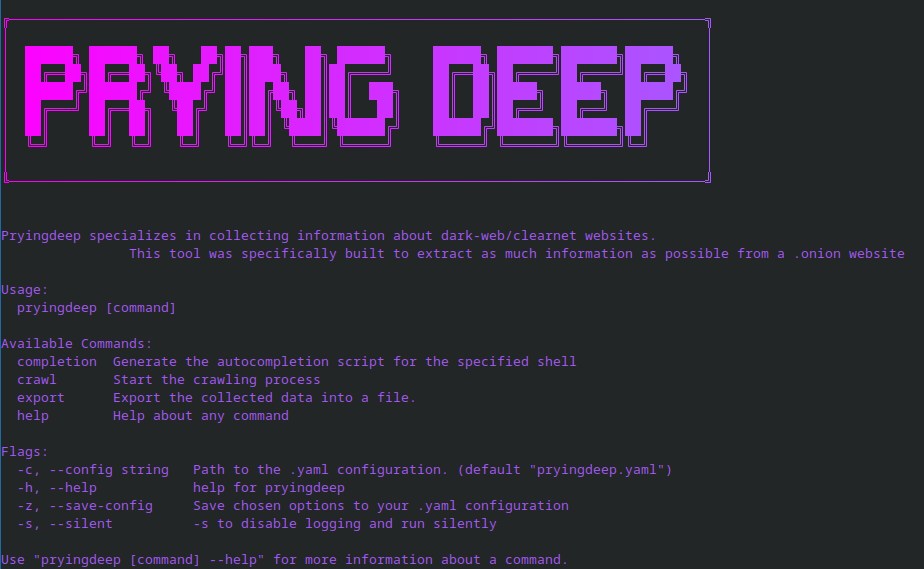
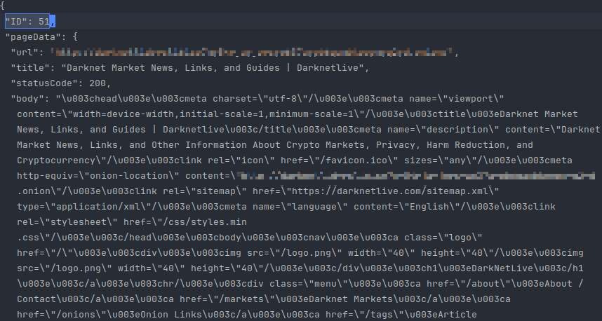
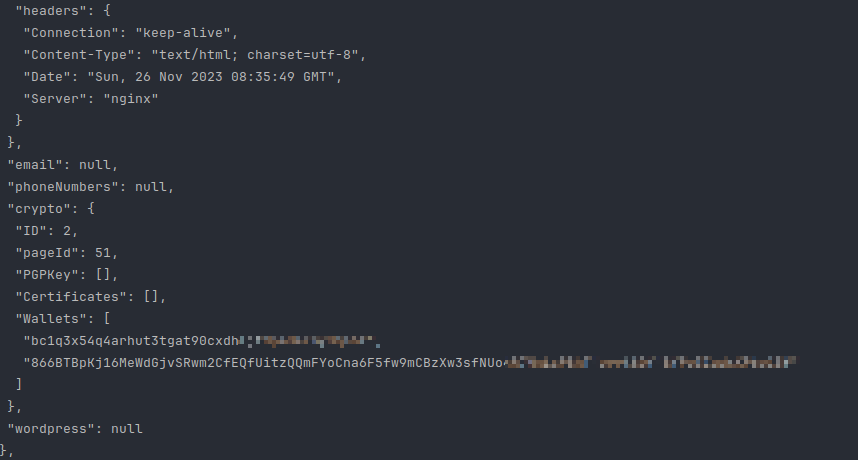

<!-- PROJECT LOGO -->
<br />
<div align="center">
  <a href="https://github.com/pryingbytez/pryingdeep/web/static/logo.png">
    
  </a>

  <h3 align="center">Prying Deep</h3>

  <p align="center">
    <b>OSINT intellegence gathering tool for the dark/clear web
    <br />
    <br />
    <a href="https://github.com/pryingbytez/pryingdeep/issues">Report Bug</a>
    <a href="https://github.com/pryingbytez/pryingdeep/issues">Request Feature</a>
  </p>
</div>


<!-- TABLE OF CONTENTS -->
<details>
  <summary>Table of Contents</summary>
  <ol>
    <li>
      <a href="#about-the-project">About The Project</a>
    </li>
    <li>
      <a href="#getting-started">Getting Started</a>
      <ul>
        <li><a href="#prerequisites">Prerequisites</a></li>
        <li><a href="#manual-installation">Manual Installation</a></li>
        <li><a href="#binary-installation">Binary Installation</a></li>
      </ul>
    </li>
    <li>
      <a href="#docker">Docker</a>
      <ul>
        <li><a href="#tor">Tor</a></li>
      </ul>
    </li>
    <li><a href="#usage">Usage</a></li>
    <li><a href="#roadmap">Roadmap</a></li>
    <li><a href="#contributing">Contributing</a></li>
    <li><a href="#license">License</a></li>
  </ol>
</details>


<!-- ABOUT THE PROJECT -->
## About The Project

I've seen multiple projects out there in GitHub, that are crawlers for the deep web,
but most of them did not meet *my* standards of OSINT on the deep web.
So I decided to create my own deep web OSINT tool.


This tool serves as a reminder that the best practices of OPSEC should always be followed in the deep web.

<u>The author of this project is not responsible for any possible harm caused by the usage of this tool.</u>


---
## What does it do?

Prying Deep crawls dark/clear net platforms and extracts as much intelligence as possible effectively.

---


---

Note:
 ⚠️ *PhoneNumber* module is currently not working.
Please do not use it as of now.
---


<!-- GETTING STARTED -->
## Getting Started


### Prerequisites

Before you can use our OSINT tool, please ensure you have the following dependencies installed:

1. **Docker: (optional)**
    -
You can download and install Docker
by following the official installation instructions for your specific operating system:
    - [Docker Installation Guide](https://docs.docker.com/get-docker/).

2. **Go: (required)**
    - [Golang Installation Guide](https://go.dev/doc/install).

3. **PostgresSQL: (required if you don't use docker)**
    - Make sure your .yaml environment variables matcht the environment in `docker-compose.yaml`
    - [PostgreSQL Installation](https://www.postgresql.org/download/)


### Binary Installation

1. Install the binary via:

```Sh
go install -v github.com/iudicium/pryingdeep/cmd/pryingdeep@latest
```

2. Grab the default .yaml configuration and place it inside the `$HOME/.pryingdeep` folder
```sh
wget https://raw.githubusercontent.com/iudicium/pryingdeep/main/pryingdeep.yaml
```
3. Adjust the values inside the config folder to your needs.

### Manual Installation

1. Clone the repo: 
   ```sh
    git clone https://github.com/pryingbytez/pryingdeep.git     
   ```

2. Adjust the values in the .yaml configuration either through flags or manually.
   `Database`, `logger`, `tor` all require manual configuration
``. <br>
<u>You *will need to read*</u> [Colly Docs](https://github.com/gocolly/colly/blob/v1.2.0/colly.go). Also, refer to [Config Explanation](./docs/CONFIG.MD#table-of-contents)


3. Build the binary via
   - `go build` -> directory: `cmd/pryingdeep`
   - `go build cmd/pryingdeep/pryingdeep.go` -> root directory, binary will also be there. 

## Docker

To start run *pryingdeep* inside a docker container use this command:
```sh
docker-compose up
```


## Config
Read more each parameter here:
[config](./docs/CONFIG.MD#table-of-contents)


## Tor
Read more about building and running our tor container here:
[Tor](./build/package/tor/README.MD#build)


<!-- USAGE EXAMPLES -->
## Usage

Crawler:
   ```sh
   ./pryingdeep crawl
   ```

Exporter:
 ```sh
 ./pryingdeep export
  ```

<!-- ROADMAP -->
## Roadmap

- [ ] Fix the phoneNumber module, get it to at least 50%
- [ ] Implement file identification and search
- [ ] Add an `install` module which will automatically grab the config and place it in the specified directory.

<!-- CONTRIBUTING -->
## Contributing


If you have a suggestion that would make this better, please fork the repo and create a pull request. You can also simply open an issue with the tag "enhancement".
Don't forget to give the project a star! Thanks again!

1. Fork the Project
2. Create your Feature Branch (`git checkout -b feature/AmazingFeature`)
3. Commit your Changes (`git commit -m 'Add some AmazingFeature'`)
4. Push to the Branch (`git push origin feature/AmazingFeature`)
5. Open a Pull Request


<!-- LICENSE -->
## License

Distributed under the GPL-3.0 license. See `LICENSE` for more information.


## Preview





